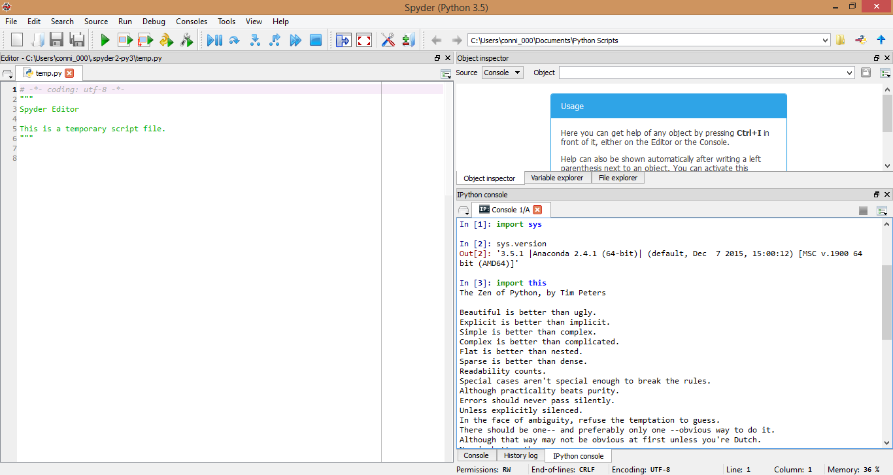

UECM3033 Assignment #1 Report
========================================================

- Prepared by: Connie Liaw Hong Yao
- Tutorial Group: T3

--------------------------------------------------------

## Task 1 -- setup a github repository

The reports, codes and supporting documents are uploaded to Github at: 

[https://github.com/ConnieLiaw1108/UECM3033_assign1](https://github.com/ConnieLiaw1108/UECM3033_assign1)

---------------------------------------------------------

## Task 2 -- setup python

------------------------------------------------------------

## Task 3 -- modify and run Python script

1. Hexadecimal representation of 1307632 is 0x13f3f0

2. $$\int_0^{\frac12} e^x + 2\cos {x\pi} dx = 2\pi + 0.648721270700128

3.\begin{align*}
  x_0 + x_2 &= 6,\\
  2 x_0 + 3 x_4 &= 34,\\
  4 x_1 + 6 x_6 &= 110,\\
  x_1 + 2 x_9 &= 29,\\
  8 x_2 + x_4 &= 42,\\
  10 x_4 + x_8 &= 120,\\
  x_3 + x_6 &= 21,\\
  5 x_5 + 3 x_9 &= 76,\\
  x_7 + 4 x_8 &= 83,\\
  2 x_5 + 9 x_7 &= 43.
  \end{align*}

  Solution =  [  2.   5.   4.   6.  10.   8.  15.   3.  20.  12.]

-----------------------------------

last modified: 28/01/2016
